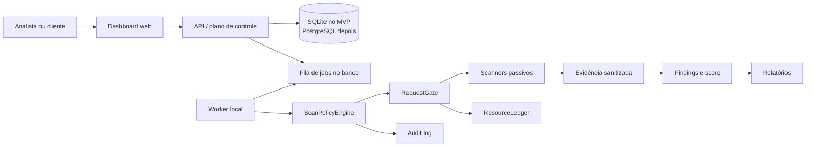

# Arquitetura

O painel e a API administram dados; o worker, inicialmente no computador do analista, executa as verificações. Esse desenho reduz custo e evita enviar dados de clientes para infraestrutura de terceiros.

`safescope_core` contém regras de domínio e não depende de frameworks. `safescope_scanners` implementa plugins. Quando existir, a camada de transporte deverá resolver DNS, consultar o `SSRFGuard` antes da conexão e reaplicar o `RequestGate` em cada redirecionamento.

## Decisões

- SQLite com WAL no desenvolvimento; interfaces de repositório evitam acoplamento para migração posterior a PostgreSQL/Supabase.
- A fila inicial é uma tabela de jobs, sem Redis ou Celery.
- ZAP Baseline, se integrado, fica limitado a modo passivo. Nenhuma ferramenta externa recebe comandos livres do usuário.
